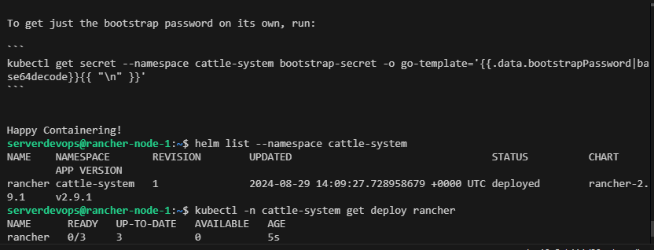
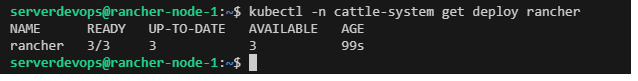
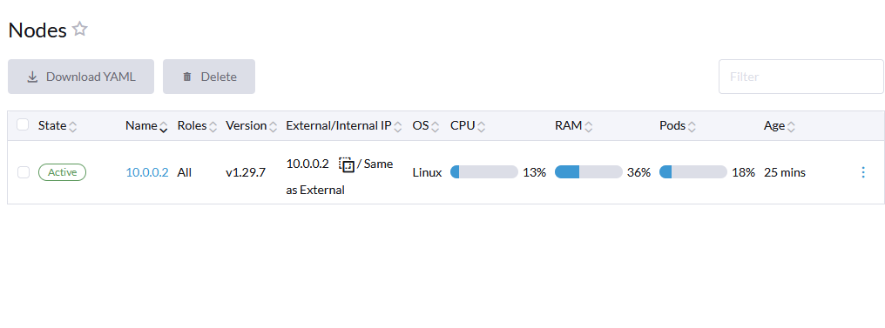

```
instance_internal_ips = [
  "10.0.0.3",
  "10.0.0.4",
]
instance_ips = [
  "35.232.157.57",
  "35.193.165.72",
]
```

# Single Node | RKE v1.6.1 | Rancher 2.9 | Kubernetes v1.29.7

```
ssh -i rancher-multinode/rancher-key.pem rancher@35.232.157.57
```


```
sudo su
cat /home/serverdevops/cluster.yml
su serverdevops
cat /home/serverdevops/.ssh/id_rsa.pub
echo "ssh-rsa AAAAB3NzaC1yc2EAAAADAQABAAABAQC80QIWUm23u47pB6hyDxCRWPsm1O8vG1oODjqjW3TOkn9u9/GxOSHTHfTBk/2S1GQnY0PPgVNJ8n7txSa4Q+w840IRAplSSxfIIXYQUUazX1e28tlEF9C49YWFe19DmSEoQYnym2SWf2td/aXCQ5eb/JliltLQfFE6h+olF4RDPqSGmq8UMydaGgBDJLYE9s1F4Vo5NSLAbmhjNbiXf3oEInAaR0BghAcLdj+C3WbNeFb9hga+IyzdfwamN9IwfkTMxLD8JAII8ydNHJG2pap7zgkFXLGV/Rcp5nDNXggN1pH3MCuk0UoBroae94HTlkP7yUJ+S55WZVjpwPZOgOlP ansible-generated on rancher-node-1" >> ~/.ssh/authorized_keys
ssh serverdevops@10.0.0.3 # tes ssh
```

```
cd /home/serverdevops/
nano cluster.yml # sesuaikan IP
rke up --config cluster.yml
INFO[0176] Finished building Kubernetes cluster successfully
export KUBECONFIG=$HOME/kube_config_cluster.yml
kubectl get nodes
```

```
helm repo add rancher-latest https://releases.rancher.com/server-charts/latest
kubectl create namespace cattle-system
kubectl apply -f https://github.com/cert-manager/cert-manager/releases/download/v1.13.2/cert-manager.crds.yaml
helm repo add jetstack https://charts.jetstack.io
helm repo update
helm install cert-manager jetstack/cert-manager --namespace cert-manager --create-namespace --version v1.13.2
helm install rancher rancher-latest/rancher --namespace cattle-system --set hostname=ranchergcp.anakdevops.online
helm list --namespace cattle-system
kubectl -n cattle-system get deploy rancher
```






```
AnakDevOpsMenyala17
```

# Add Worker Node | RKE v1.6.1 | Rancher 2.9 | upgrade Kubernetes v1.29.7 to v1.30.3

```
instance_internal_ips = [
  "10.0.0.3",
  "10.0.0.4",
]
instance_ips = [
  "35.232.157.57",
  "35.193.165.72",
]
```

```
ssh -i rancher-multinode/rancher-key.pem rancher@35.193.165.72
sudo su
su serverdevops
cat /home/serverdevops/.ssh/id_rsa.pub
echo "ssh-rsa AAAAB3NzaC1yc2EAAAADAQABAAABAQCh9pehJuT/3ch+f5jnc2DxF9RVFmoHNMQ0eeA26IOXgYM0YtbUKwCs+/fryJTUoiqHjijl7SEOheynKuoDakmsKTNpEFJNRd7FJHH66sn+KvWahUYGtqAt2ysXywezyRNm6oOkeU1ZhNonriIbb8bx/M+K+BW+pdotOB7LanCr07a+v/UWhiIiU/9LDjXZBSlD79IBTrlyKT+BbpD0Bv/U2C5HI17UQn0aCuNy4zmzC38Lm/CSMVEa8FQL8Dq2Lb45j4R4G8yYW9fQvFAcdBBH1pIU/8aMSeSs4WHSsm7/dMJ1MVfSww07OLMnLDfm+4VjUffz3DnNjslHCeDQ8kfd ansible-generated on rancher-node-2" >> ~/.ssh/authorized_keys
ssh serverdevops@10.0.0.3 # node 1
ssh serverdevops@10.0.0.4 # node 2
rke config --list-version --all #cek kubernetes version

v1.27.16-rancher1-1
v1.29.7-rancher1-1
v1.28.12-rancher1-1
v1.30.3-rancher1-1

cd /home/serverdevops/
nano cluster.yml #Add IP Node 2
cat cluster.yml #pastikan sudah sesuai
rke up --config cluster.yml 
```


