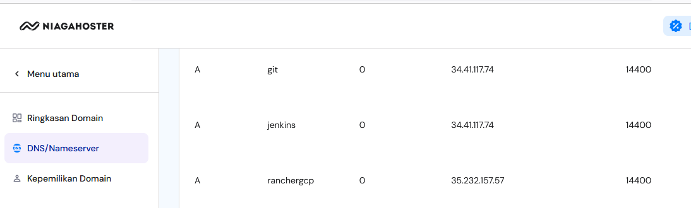
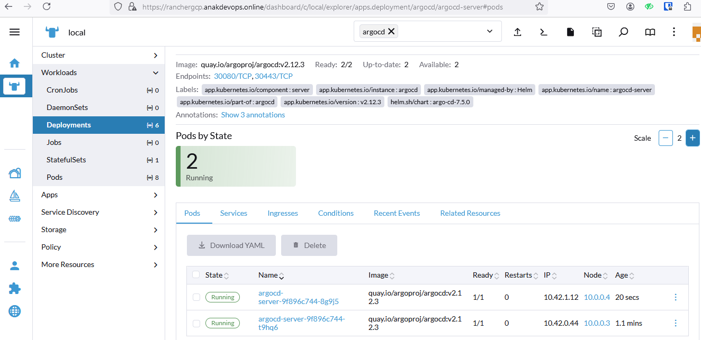

```
Recommended Service Account roles:
Compute Admin
Network Management Admin
```


# Domain Management




```
pastikan sudah mendownload credential .json
```


```
./init_terraform.sh
./manage_terraform.sh
./output_terraform.sh
./destroy_terraform.sh
```


# OR

```
terraform plan -var-file="../terraform.tfvars"
terraform apply -var-file="../terraform.tfvars" -auto-approve
terraform destroy -var-file="../terraform.tfvars" -auto-approve
```


```
sudo openssl genrsa -out jenkins.anakdevops.online.key 2048
sudo openssl req -new -key jenkins.anakdevops.online.key -out jenkins.anakdevops.online.csr
sudo openssl x509 -req -days 365 -in jenkins.anakdevops.online.csr -signkey jenkins.anakdevops.online.key -out jenkins.anakdevops.online.crt
sudo openssl x509 -in jenkins.anakdevops.online.crt -text -noout
```

# ARGOCD

```
# values.yaml
controller:
  replicaCount: 2

server:
  replicaCount: 2
  service:
    type: LoadBalancer

redis:
  replicaCount: 2
  sentinel:
    enabled: true

dex:
  replicaCount: 2
```


```
helm repo add argo https://argoproj.github.io/argo-helm
helm repo update
helm install argocd argo/argo-cd -f values.yaml --namespace argocd --create-namespace --set global.domain=argocd.anakdevops.online
kubectl -n argocd get secret argocd-initial-admin-secret -o jsonpath="{.data.password}" | base64 -d
```

