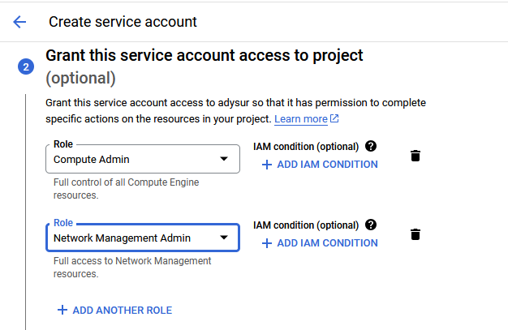

```
Recommended Service Account roles:
Compute Admin
Network Management Admin
```



```
pastikan sudah mendownload credential .json
```


```
./init_terraform.sh
./manage_terraform.sh
./output_terraform.sh
./destroy_terraform.sh
```


# OR

```
terraform plan -var-file="../terraform.tfvars"
terraform apply -var-file="../terraform.tfvars" -auto-approve
terraform destroy -var-file="../terraform.tfvars" -auto-approve
```


```
sudo openssl genrsa -out jenkins.anakdevops.online.key 2048
sudo openssl req -new -key jenkins.anakdevops.online.key -out jenkins.anakdevops.online.csr
sudo openssl x509 -req -days 365 -in jenkins.anakdevops.online.csr -signkey jenkins.anakdevops.online.key -out jenkins.anakdevops.online.crt
sudo openssl x509 -in jenkins.anakdevops.online.crt -text -noout
```